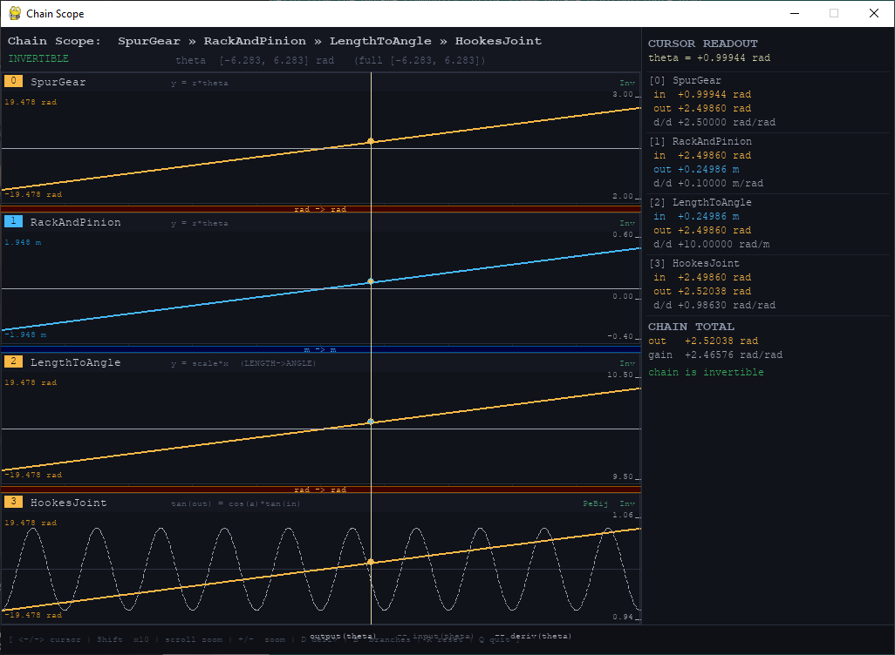

# Mechanical Motion Primitives (MMP)



Mechanical-to-mathematical mappings for modeling transmission chains as composable, 
typed, domain-aware functions. Each mechanism expresses a forward() mapping with a declared physical domain, 
unit type, and where mechanically valid, an inverse() and derivative().  
Primitives compose into chains that validate unit compatibility at construction time, 
treating mechanical motion the same way a compiler treats types.  

# AI/LLM Use
This project was extensively developed and prototyped with DeepSeek, Qwen, and Claude working as one team.  
Architecture decisions, bug hunting, domain modeling, and code review were all collaborative.  
The Governor domain fix, adapter design, builder immutability contracts, and pytest layout resolution all came out of those sessions.  

```    
# Project Structure

    mmp/
        core/
            base.py             - Dimension, Domain, Primitive protocols
            constants.py        - MechanicalLimits
            exceptions.py       - MMPError hierarchy
        primitives/
            class_i_linear.py   - SpurGear, CompoundGearTrain, RackAndPinion, Wedge, OldhamCoupling
            class_ii_periodic.py - ScotchYoke, EccentricCam, CrankSlider, HookesJoint
            class_iii_adapters.py - UnitAdapter, AngleToLength, LengthToAngle,
                                    UnitlessScaling, Bias, FunctionAdapter
        composite/
            chain.py            - CompositePrimitive
            governor.py         - Governor
        builders/
            ic_builder.py       - ICBuilder
            cc_builder.py       - CCBuilder

```

# Primitive Classes

## Class I - Linear Scaling (Affine Maps)

Continuous, invertible, constant-ratio primitives. The workhorses of rotational and
linear transmissions. All Class I primitives are monotonic and fully invertible.

    SpurGear(ratio)                              ANGLE -> ANGLE
    CompoundGearTrain(ratios)                    ANGLE -> ANGLE
    RackAndPinion(pitch_radius)                  ANGLE -> LENGTH
    Wedge(angle_rad)                             LENGTH -> LENGTH
    OldhamCoupling(offset_x, offset_y)           ANGLE -> ANGLE

## Class II - Periodic Non-Linear (Trigonometric)

Oscillatory, bounded-output primitives. Non-injective over the full domain.
Subdivided by inversion behavior:
```
    PeriodicBijective         - invertible within one period, no branch selection needed
    PeriodicBranchDependent   - non-injective, inverse requires explicit branch selection
```

Primitives:
```
    ScotchYoke(amplitude, phase)                 ANGLE -> LENGTH
    EccentricCam(eccentricity, follower_radius)  ANGLE -> LENGTH
    CrankSlider(crank_length, rod_length)        ANGLE -> LENGTH
    HookesJoint(shaft_angle)                     ANGLE -> ANGLE
```
## Class III - Adapters

Admissible and inadmissible fictional mathematical transformations. These do not
correspond to a single physical mechanism but carry full unit semantics, enabling
the compositor to validate dimensional flow in constructed or exploratory chains.
```
    UnitAdapter                                  Abstract base for all adapters
    AngleToLength(scale)                         ANGLE -> LENGTH
    LengthToAngle(scale)                         LENGTH -> ANGLE
    UnitlessScaling(scale, unit)                 UNIT -> UNIT (same, scaled)
    Bias(bias, unit)                             UNIT -> UNIT (same, offset)
    FunctionAdapter(fwd, inv, input_unit,        Arbitrary invertible function
                    output_unit, name, deriv)
```

# Domain and Units

Every primitive declares a Domain: the physical envelope it accepts and produces.

    @dataclass(frozen=True)
    class Domain:
        min:          Optional[float]   # None = unbounded input
        max:          Optional[float]
        input_unit:   Dimension         # ANGLE | LENGTH | RATIO | VELOCITY | GENERIC
        output_unit:  Dimension
        output_min:   Optional[float]   # None = unbounded output
        output_max:   Optional[float]

CompositePrimitive back-propagates output constraints to compute input_domain: the
range of motor inputs that keeps every intermediate stage within its physical bounds.
For monotonic invertible prefix chains this is exact; for non-monotonic stages it
falls back conservatively. Non-invertible stages (Governor) are skipped during
back-propagation as their bounds constrain output only.

# Governor

Wraps any primitive and clamps its output to [min_val, max_val]. Inserting a Governor
permanently sets is_invertible = False on the entire chain. Clamping is a lossy
operation: information destroyed at the limits cannot be recovered.

Governor bounds are output constraints only. The input is unconstrained: the motor
can turn freely, the Governor only limits what reaches the downstream stage.

# Exceptions
```
    DimensionMismatchError    Incompatible unit types connected at build time
    DomainViolationError      Output range of stage N exceeds input domain of stage N+1
    InverseUndefinedError     inverse() called on a non-invertible or Governor chain
```

# Chain Builders

Two builders, both immutable. Validation happens at build time, not runtime.

## ICBuilder - Industrial / Conservative

Enforces unit compatibility at every junction. Connecting mismatched units raises
DimensionMismatchError at build time. Only real physical primitives (Class I and II).

```
    wrist = (ICBuilder()
        .add(SpurGear, ratio=2.5)
        .add(HookesJoint, shaft_angle=0.3)
        .add(RackAndPinion, pitch_radius=0.1)
        .add_governor(min_val=-2.0, max_val=2.0)
        .build())

    position     = wrist.forward(1.5)        # motor angle -> actuator position
    motor_angle  = wrist.inverse(1.2)        # raises InverseUndefinedError (Governor present)
    ratio        = wrist.derivative(1.5)     # instantaneous transmission ratio
    in_range     = wrist.input_domain.contains(theta)
```

## CCBuilder - Creative / Experimental

Supports all ICBuilder operations and additionally accepts Class III adapters.
add_adapter() infers from_unit from the chain tail; only to_unit is required.

```
    experiment = (CCBuilder()
        .add(SpurGear, ratio=2.5)
        .add(RackAndPinion, pitch_radius=0.1)
        .add_adapter(to_unit=Dimension.ANGLE, scale=10.0)   # LENGTH -> ANGLE
        .add(HookesJoint, shaft_angle=0.3)
        .build())
```

# Diagnostic Viewer


analyser.py provides an oscilloscope-style visual probe for any CompositePrimitive.
One channel per primitive stage. Shared x-axis is root theta. Traces show output,
input feed-through, and derivative as a function of root theta. Governor clamp lines,
stage unit connectors, and per-stage cursor readout are included.
```
    from analyser import scope
    scope(wrist)
```
Controls: arrow keys move cursor, scroll wheel zooms, D toggles derivative traces,
B toggles branch traces, R resets view, Q quits.
